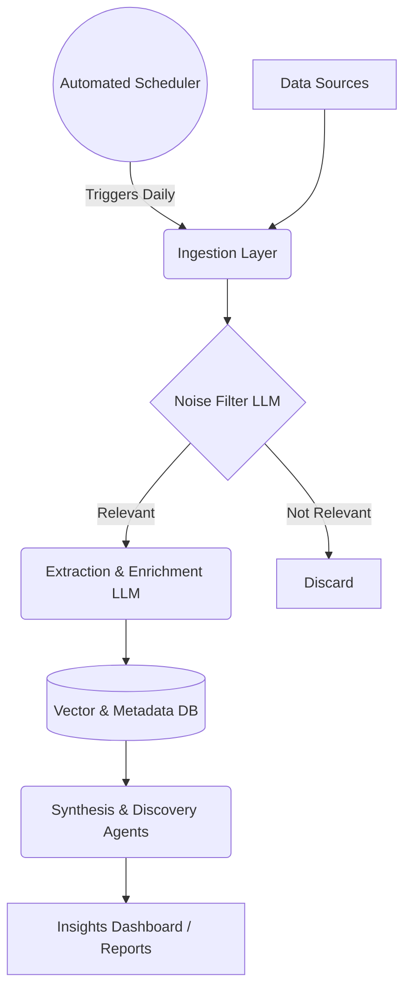

# AI-Powered Discovery Engine: Architecture

This document outlines the architecture for the AI-Powered Discovery Engine designed to analyze user feedback and conversations about photo retrieval at scale, as defined in Part 1 of the project.

## 1. High-Level System Overview
The Discovery Engine is an automated pipeline that ingests raw user feedback, filters out noise, extracts structured insights regarding retrieval failures, and synthesizes these into actionable evidence-backed opportunity areas.

## 2. Component Breakdown

### A. Data Sources & Ingestion Layer
**Purpose:** Collect public feedback related to photo retrieval struggles.
*   **Sources:** Google Play Store reviews, App Store reviews, Reddit (e.g., r/googlephotos), Twitter/X, and Google Support Forums.
*   **Tools:** 
    *   Python scraping libraries (e.g., `google-play-scraper`, `praw` for Reddit).
    *   *Alternative:* No-code tools like Apify or n8n to automate daily scraping.
*   **Mechanism:** Keyword-based filtering (e.g., "search", "can't find", "remember", "lost", "old photo") to pull a broad initial dataset.

### B. Processing Pipeline (The "Brain")
**Purpose:** Transform messy unstructured text into structured, analyzable data.
*   **Tech Stack:** Python + LangChain / LlamaIndex + LLM (Gemini or Groq).

**Step 1: Noise Filter**
*   *Prompt:* "Is this user feedback specifically about struggling to retrieve an old photo due to incomplete memory? (Yes/No)"
*   Filters out complaints about storage space, app crashes, or general features.

**Step 2: Structured Extraction**
*   For relevant posts, use the LLM to extract a strict JSON schema answering the key questions:
    *   `struggle_type`: What kind of photo are they looking for?
    *   `remembered_info`: What clues do they have? (e.g., objects, colors, feelings).
    *   `forgotten_info`: What is missing? (e.g., exact date, location).
    *   `search_queries`: How did they try to search for it?
    *   `quote`: The raw evidence/quote from the user.

### C. Data Storage
**Purpose:** Store the processed data for deeper querying, comparison, and analysis.
*   **Vector Database (e.g., ChromaDB):** Stores text embeddings (generated via the BGE embedding model) of the user feedback, allowing the system to group semantically similar retrieval problems.
*   **Metadata DB (e.g., SQLite / PostgreSQL):** Stores the structured JSON data extracted by the LLM along with source links and timestamps.

### D. Synthesis & Discovery Agents
**Purpose:** Identify patterns, compare problems, and generate actionable reports.
*   **Clustering Agent:** Runs over the extracted data to identify the top N recurring failure modes (e.g., "Users can describe the aesthetic but not the location", or "Users remember the people but not the timeline").
*   **RAG (Retrieval-Augmented Generation) Q&A:** A conversational interface where the Product Manager can ask the engine questions like: *"Show me examples of users struggling to find photos of documents or receipts,"* and the engine responds with synthesized insights and direct quotes.

### E. Automated Scheduler Component
**Purpose:** Automate the entire end-to-end process so the Discovery Engine runs autonomously.
*   **Trigger:** A CRON job or Python `schedule` loop that triggers daily at a set time.
*   **Workflow:**
    1. Triggers the Ingestion scripts to scrape new data from the last 24 hours.
    2. Triggers the Processing Pipeline to extract insights via the LLM.
    3. Triggers the Storage script to append new embeddings to ChromaDB.
    4. Ensures the dashboard is always serving the freshest, real-time insights without manual intervention.

## 3. Recommended Tech Stack
If you are building this quickly as a proof-of-concept:
1.  **Scripting/Orchestration:** Python with LangChain.
2.  **LLM:** Groq or Gemini (chosen based on speed and complex structured extraction capabilities).
3.  **Embedding Model:** BGE (BAAI General Embedding) model for local, high-quality vector embeddings rather than OpenAI.
4.  **Database:** SQLite (for structured metadata) + ChromaDB (for local vector storage).
5.  **UI/Output:** Streamlit (to easily build an interactive web interface for exploring the data and asking the engine questions).

## 4. Expected Data Flow
1.  `scrape_reddit.py` pulls 1000 posts about Google Photos.
2.  `pipeline.py` passes them to the LLM. 200 are identified as relevant memory retrieval failures.
3.  The LLM structures those 200 posts into detailed JSON profiles.
4.  The data is embedded into ChromaDB.
5.  `streamlit_app.py` reads the DB, groups the top 3 failure categories, and displays them with supporting user quotes.
